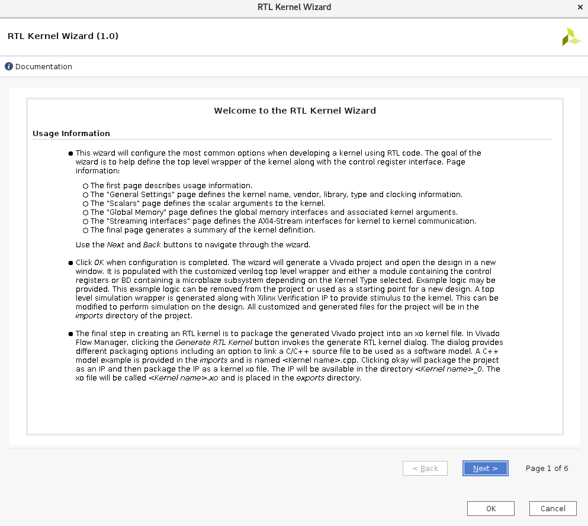
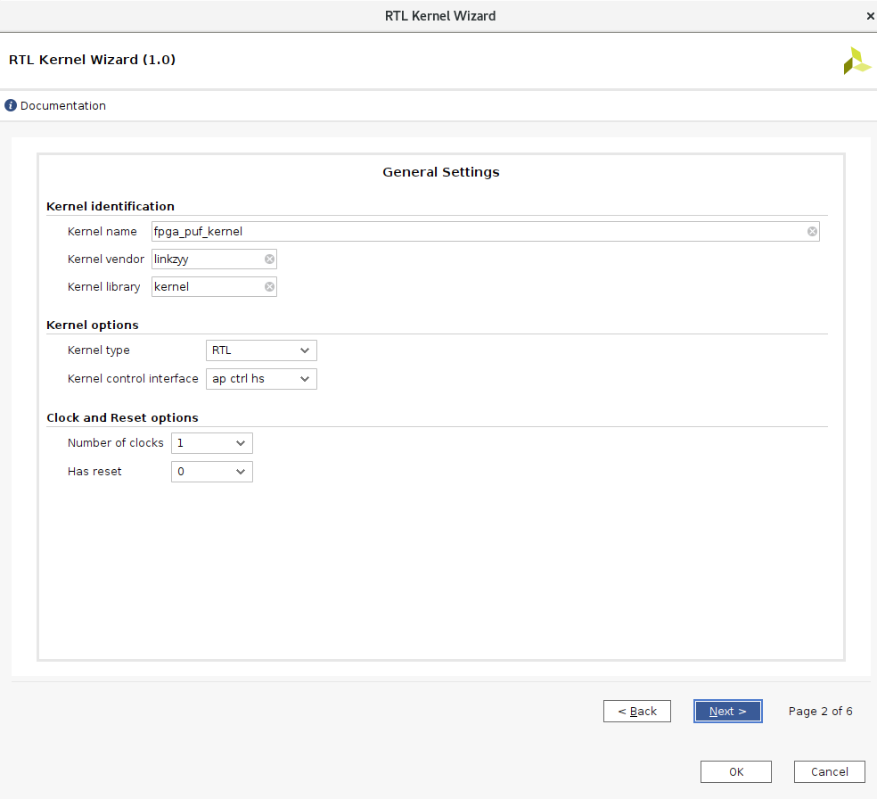
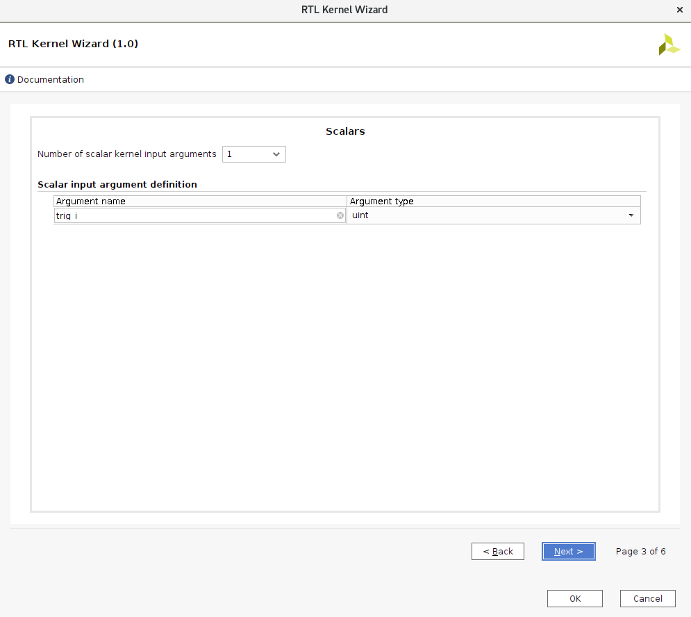
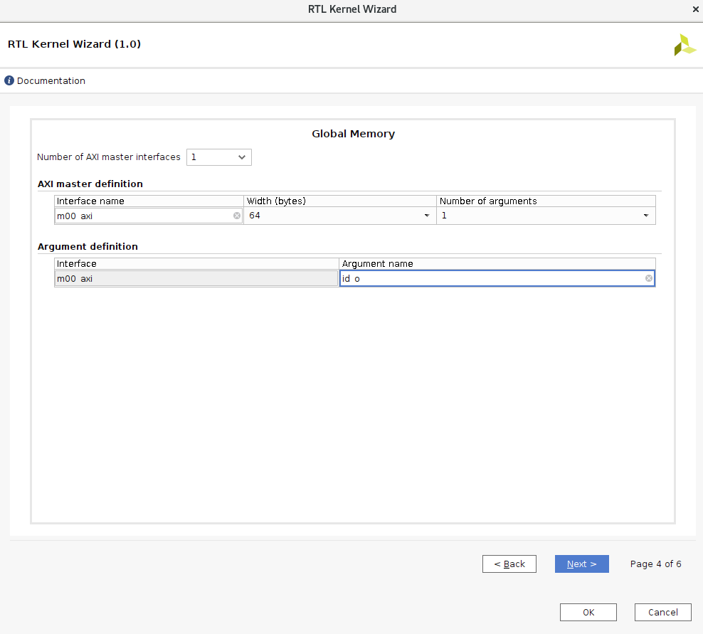
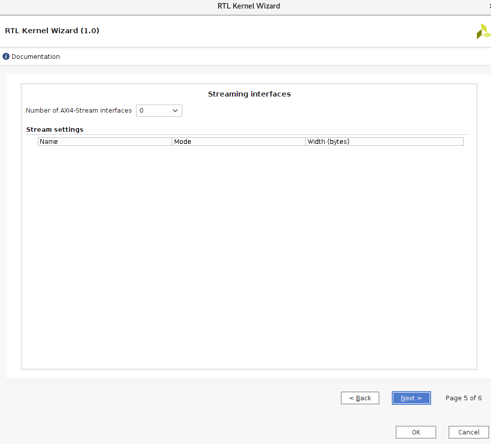
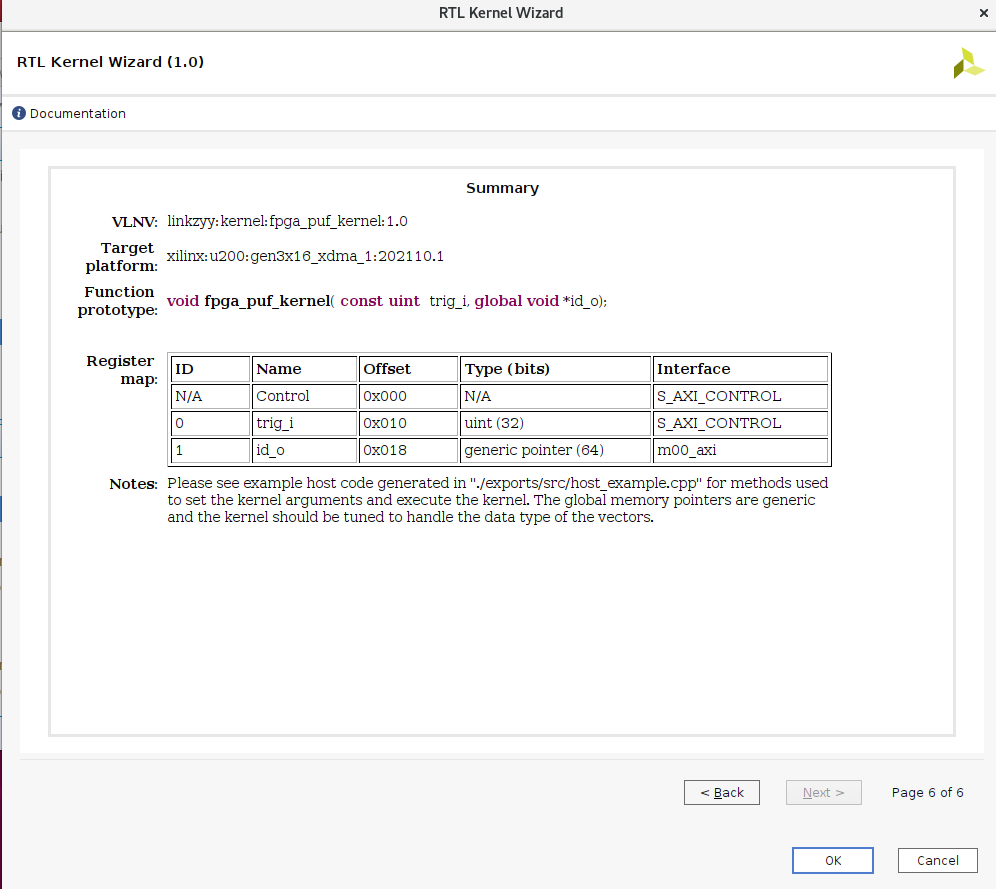
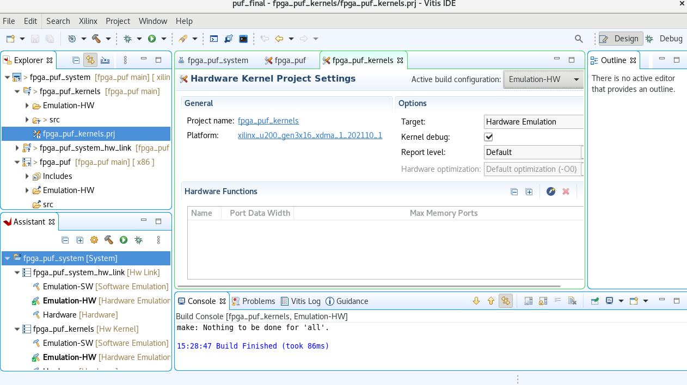
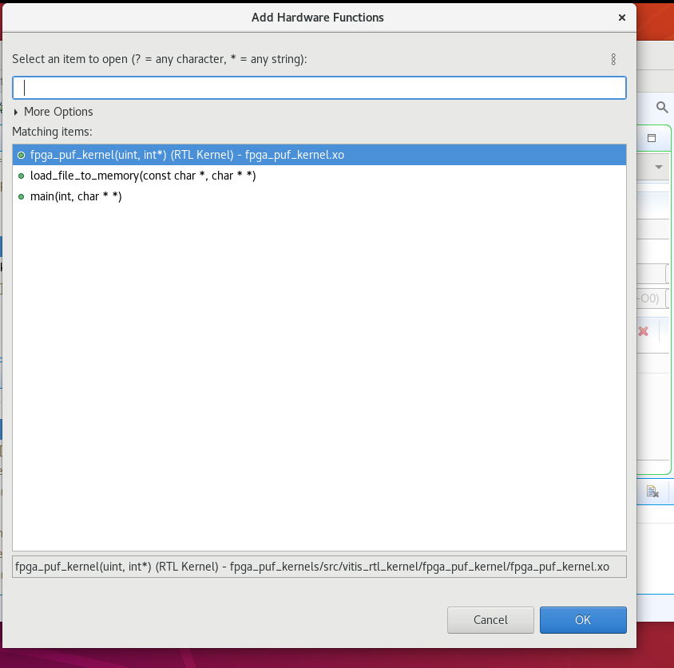

# FPGA PUF with AXI bus

A simple implementation of FPGA PUF with AXI bus.

This work can generate 96 bit puf with a Xilinx Alveo u200 card, which can be used in private key, etc.

## Tutorial

### Build the `.xclbin`
1. Open the `Xilinx/Launch RTL wizard kernel`.
   
2. Create a kernel, and set the kernel name.
   
3. Set the scalar arguments.
   
4. Set the AXI arguments.
   
5. Do nothing.
   
6. Check the opencl kernel prototype.
   
7. Load the rtl sources and it will automatically create `fpga_puf_kernels.prj`.
   
8. Add hardware functions
   
9. build

### Build the host
```bash
g++ -I$XILINX_XRT/include/ -I$XILINX_VIVADO/include/ -Wall -O0 -g -std=c++11 host.cpp  -o 'host'  -L$XILINX_XRT/lib/ -lOpenCL -lpthread -lrt -lstdc++
```
### Execute


```bash
$ ./host binary_container_1.xclbin xilinx_u200_gen3x16_xdma_base_1
```
